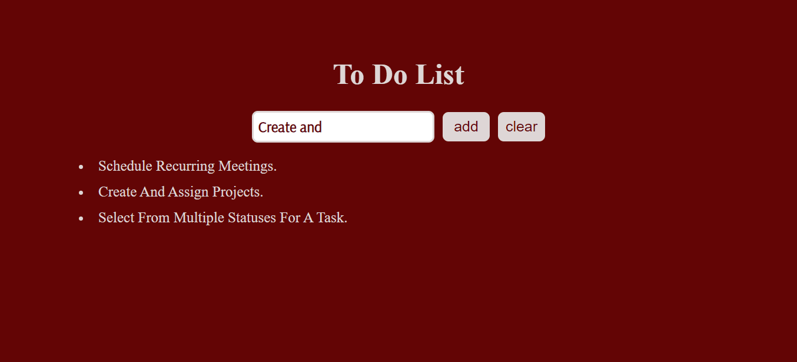

# to_do_list_2

<h2>I made this to do list with the help of HTML, CSS and JavaScript.</h2>

<h3> I used JavaScript's : </h3>

 
 addEventListener('click', function(){}), 

 
 
 createElement()

 
 
 classList.add() 

 
 
 innerText= ; 

 
 
 appendChild()

 

 removeChild(). 

<h3>Preview:</h3>

Enjoy Coding ❤

